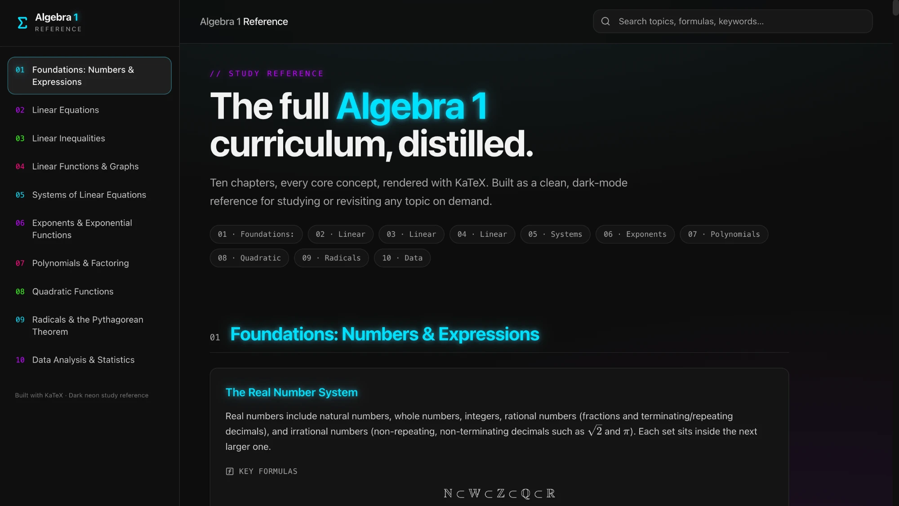
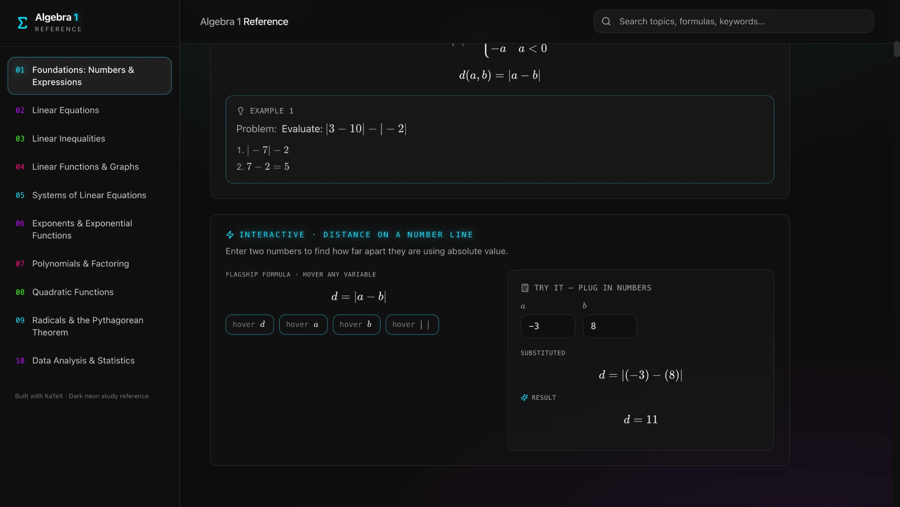

# Algebra 1 Reference

> A clean, dark-themed study reference for English-language Algebra 1.

**한국어: [README.ko.md](README.ko.md)** · **🔗 Live site: [algebra1learning.vercel.app](https://algebra1learning.vercel.app)**

<p align="center">
  
  
</p>

---

## About

Studying Algebra 1 often means flipping between a textbook and a search bar just to recall one formula. This project puts everything in one place: **10 chapters, 40 concepts**, each with a plain explanation, the key formulas, and step-by-step worked examples, plus a small interactive calculator per chapter.

## Features

- **KaTeX math rendering**: every formula is crisp and textbook-quality.
- **Live search**: filter instantly by topic, formula, or keyword.
- **Worked examples**: problems come with step-by-step solutions.
- **Interactive calculator per chapter**: change the inputs and see the result immediately.
- **Dark theme & responsive UI**: comfortable to read on desktop and mobile.
- **Static site**: no server or accounts; deploy it anywhere.

## Curriculum

| # | Chapter | Interactive |
|---|---|---|
| 1 | Foundations: Numbers & Expressions | Distance on a Number Line |
| 2 | Linear Equations | Two-Step Equation Solver |
| 3 | Linear Inequalities | Inequality Solver |
| 4 | Linear Functions & Graphs | Slope from Two Points |
| 5 | Systems of Linear Equations | 2×2 System Solver |
| 6 | Exponents & Exponential Functions | Exponential Growth & Decay |
| 7 | Polynomials & Factoring | FOIL Multiplier |
| 8 | Quadratic Functions | Quadratic Formula Solver |
| 9 | Radicals & the Pythagorean Theorem | Hypotenuse Calculator |
| 10 | Data Analysis & Statistics | Mean, Median & Range |

## Tech Stack

[Vite](https://vitejs.dev) · [React](https://react.dev) · TypeScript · [Tailwind CSS](https://tailwindcss.com) · [shadcn/ui](https://ui.shadcn.com) · [KaTeX](https://katex.org) · Vitest

## Getting Started

Requires Node.js 18 or later.

```bash
git clone https://github.com/jin-codes/Algebra1_Learning.git
cd Algebra1_Learning
npm install
npm run dev
```

Then open http://localhost:8080.

| Command | Description |
|---|---|
| `npm run dev` | Start the dev server |
| `npm run build` | Production build (`dist/`) |
| `npm run preview` | Preview the production build |
| `npm run lint` | Run ESLint |
| `npm test` | Run Vitest |

## Project Structure

```
src/
├── data/
│   ├── curriculum.ts          # Chapters, concepts, formulas, examples (content lives here!)
│   └── chapterInteractives.ts # Per-chapter calculator definitions
├── pages/Index.tsx            # Main page (search, sidebar, chapter view)
└── components/ui/             # shadcn/ui components
```

Content is **separated into data files**, so you can add or edit material without touching the UI code.

## Contributing

Typo fixes, solution error reports, and new concepts or examples are all welcome.

1. Fork this repository.
2. Create a branch: `git checkout -b fix/factoring-example`
3. To add a concept to `src/data/curriculum.ts`, follow this shape:

   ```ts
   {
     id: "my-concept",
     title: "Concept Title",
     explanation: "Short, plain-language explanation.",
     formulas: ["ax^2 + bx + c = 0"],            // KaTeX syntax
     examples: [{ problem: "…", steps: ["…", "…"] }],
     keywords: ["search", "terms"],               // used by search
   }
   ```

4. Make sure `npm run lint && npm run build` passes.
5. Open a Pull Request.

If you spot a math error, please open an [Issue](https://github.com/jin-codes/Algebra1_Learning/issues) and say which chapter and section it is in.

## Deployment

Deployed on Vercel by connecting the GitHub repository (Framework: Vite, Build: `npm run build`, Output: `dist`). Every push to `main` redeploys automatically.

## License

[MIT](LICENSE) © 2026 jin-codes
